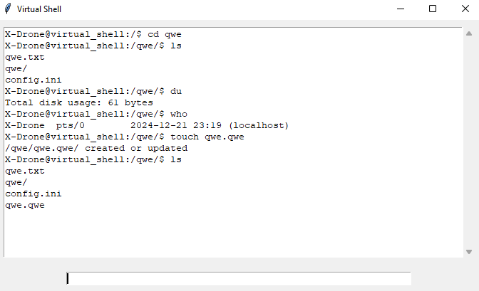
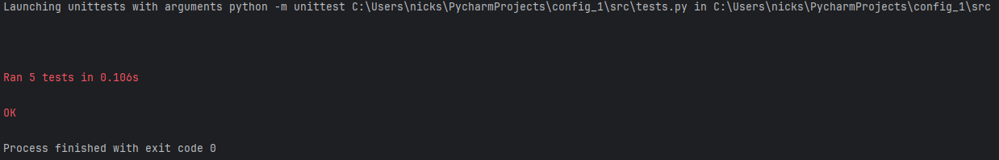

# ShellEmulator
### Общее описание
Это эмулятор sh-подобной командной строки в файловой системе .tar архива.
### Описание всех функций и настроек
В этом эмуляторе доступны следующие команды:
- ls \[-l\] <папка>
  
  Перечисление всех файлов и папок в указанной папке или текущей папке
- cd <папка>
  
  Переход в указанную папку
- exit
  
  Выход из эмулятора
- du
  
  Вывести место, занимаемое папкой
- touch <файл>

  Создать файл
- who
  
  Вывести информацию о юзере
- exit

  Выйти и закрыть

### Описание команд для сборки проекта
Проект не требует сборки. Для запуска проекта требуется Python 3.
Чтобы запустить проект перейдите в папку проекта и запустите shell_emulator.py

```
git clone https://github.com/X-Drone/config_1.git
cd config_1
pip install tkinter
python3 src/shell_emulator.py
```

### Примеры использования в виде скриншотов


### Результаты прогона тестов

